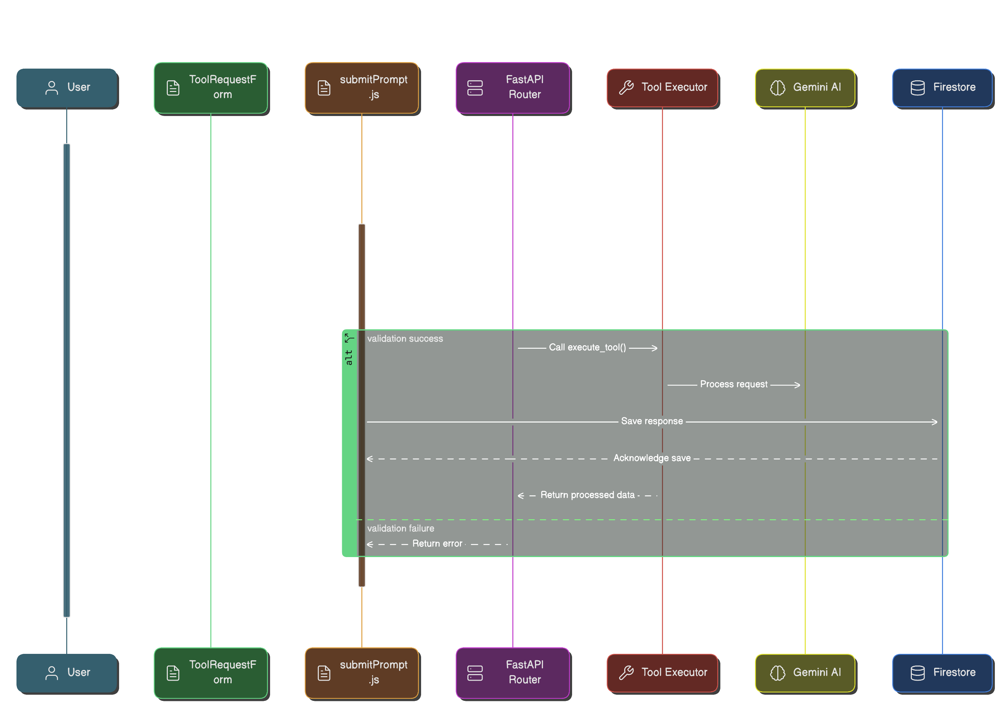

# Marvel AI Tools System

## Overview

The Marvel AI Tools System is a powerful feature set that enables AI-powered educational tools through a seamless integration between a React-based frontend and a Python FastAPI backend. The system leverages Google's Generative AI (Gemini) to provide various educational tools and features.

### Key Features

- **Modular Tool Architecture**: Each tool is a self-contained module with its own configuration, inputs, and processing logic
- **Real-time Processing**: Asynchronous processing with immediate feedback
- **State Management**: Robust state management using Redux for tool states and responses
- **Data Persistence**: Automatic saving of tool responses to Firestore
- **Error Handling**: Comprehensive error handling at both frontend and backend levels
- **Extensible Design**: Easy addition of new tools through standardized interfaces

## Architecture


*Sequence diagram showing the flow of a tool request through the system components*

### High-Level Components

```
Marvel AI Tools System
├── Frontend (Next.js)
│   ├── Tool Components
│   │   ├── ToolRequestForm
│   │   ├── ToolResponse
│   │   └── ToolsList
│   ├── Services
│   │   └── submitPrompt
│   └── State Management (Redux)
│
└── Backend (FastAPI)
    ├── API Router
    ├── Tool Registry
    ├── Tool Utilities
    └── Individual Tools
        ├── Connect With Them
        ├── Lesson Plan Generator
        └── [Other Tools]
```

### Key Technologies

- **Frontend**: Next.js, React, Redux
- **Backend**: FastAPI, Python
- **AI**: Google Generative AI (Gemini)
- **Database**: Firestore
- **Vector Store**: Chroma
- **API**: RESTful endpoints

## How It Works

### 1. Tool Request Flow

1. **User Input**
   - User selects a tool and fills in required inputs
   - Frontend validates inputs using React Hook Form

2. **API Communication**
   - Frontend sends request to `/submit-tool` endpoint
   - Request includes tool ID, inputs, and user information

3. **Backend Processing**
   - Backend validates request
   - Loads tool configuration
   - Executes tool-specific logic using Gemini AI
   - Returns processed results

4. **Response Handling**
   - Frontend receives response
   - Saves to Firestore
   - Updates UI with results

### 2. Tool Development

Each tool requires:

1. **Backend Implementation**
   ```python
   class NewTool:
       def __init__(self, config):
           self.model = config.get("model")
           self.prompt = config.get("prompt")

       async def process(self, inputs):
           # Tool-specific logic
           return result
   ```

2. **Tool Configuration**
   ```json
   {
     "tool_id": "new_tool",
     "name": "New Tool",
     "description": "Tool description",
     "inputs": [
       {
         "name": "input_field",
         "type": "string",
         "required": true
       }
     ]
   }
   ```

3. **Frontend Components**
   - Tool-specific response component
   - Custom input validators (if needed)
   - State management integration

## Testing

### Backend Testing

1. **Unit Tests**
   ```bash
   # Run backend tests
   cd marvel-ai-backend
   pytest tests/
   ```

2. **Tool Testing**
   ```bash
   # Test specific tool
   pytest tests/tools/test_tool_name.py
   ```

### Frontend Testing

1. **Component Tests**
   ```bash
   # Run frontend tests
   cd marvel-platform
   npm test
   ```

2. **Integration Tests**
   ```bash
   # Run integration tests
   npm run test:integration
   ```

### Manual Testing

1. **Local Development**
   ```bash
   # Start backend
   cd marvel-ai-backend
   ./local-start.sh

   # Start frontend
   cd marvel-platform
   npm run dev
   ```

2. **Testing New Tools**
   - Create tool configuration
   - Implement backend logic
   - Add frontend components
   - Test through UI
   - Verify Firestore storage

## Best Practices

1. **Tool Development**
   - Follow modular design principles
   - Include comprehensive error handling
   - Add proper logging
   - Write unit tests

2. **Frontend Development**
   - Use TypeScript for type safety
   - Follow React best practices
   - Implement proper error boundaries
   - Add loading states

3. **Backend Development**
   - Follow PEP 8 style guide
   - Use async/await for I/O operations
   - Implement proper validation
   - Add comprehensive logging

## Contributing

1. Fork the repository
2. Create a feature branch
3. Add your tool following the architecture guidelines
4. Add tests
5. Submit a pull request

## Troubleshooting

Common issues and solutions:

1. **Tool Execution Failures**
   - Check input validation
   - Verify API key configuration
   - Check Gemini AI service status

2. **Frontend Issues**
   - Clear browser cache
   - Check Redux DevTools
   - Verify API endpoint configuration

3. **Backend Issues**
   - Check logs
   - Verify environment variables
   - Check Python dependencies
